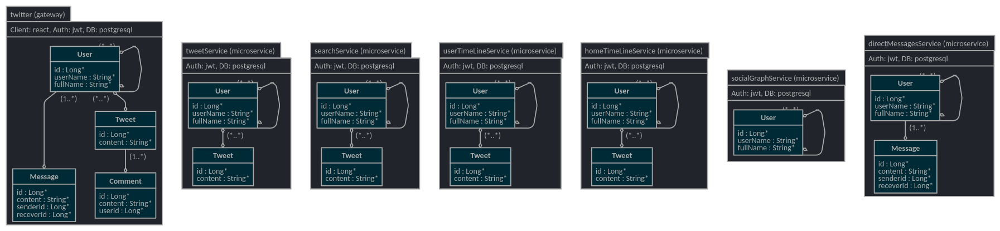
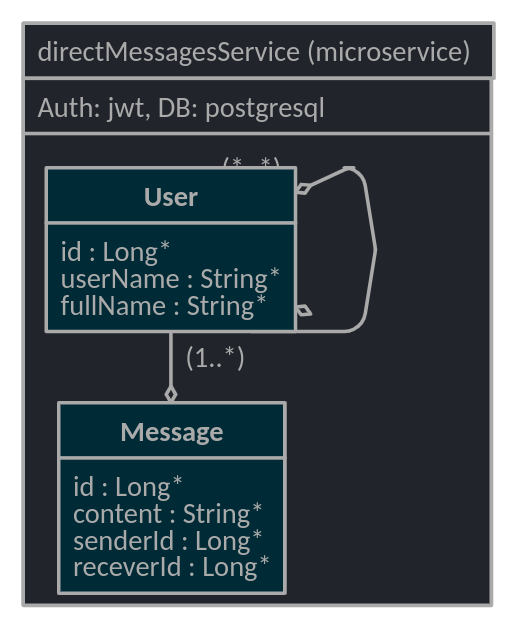
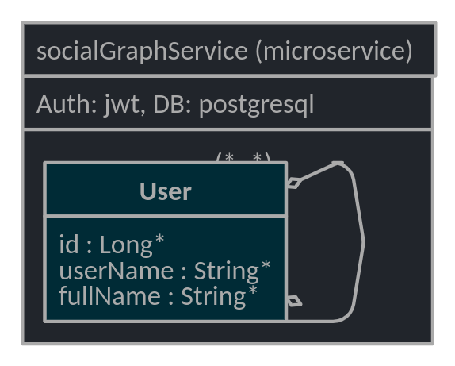
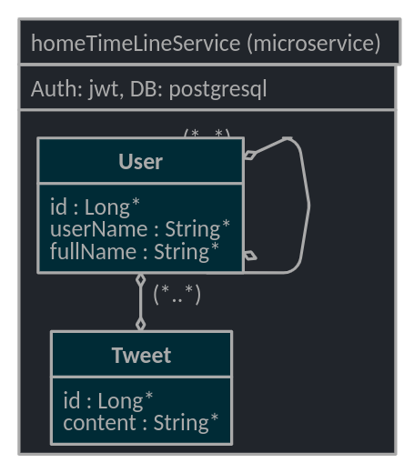
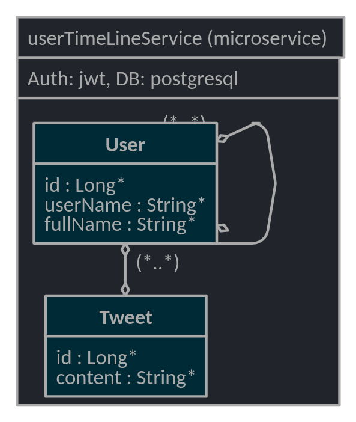
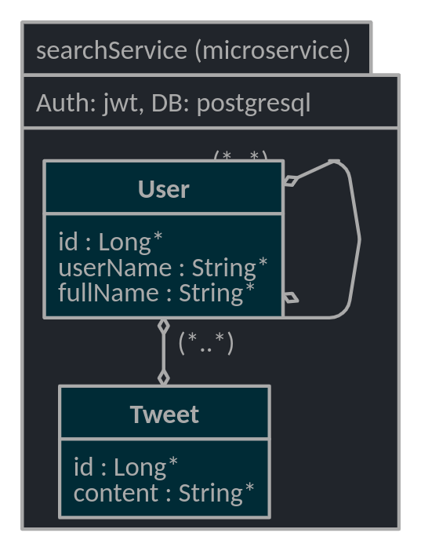
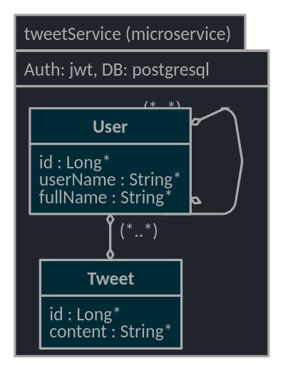
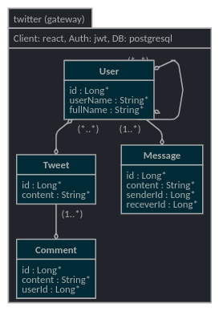

# Projet ALBC

***Membres de groupe:***

*KOTBI Abderrahmane & El HAFI Abdessamad*
===

> La première partie contient les éléments suivants:
> * Liste des fonctionnalités recensé par module.
> * Les inputs et outputs pour chaque fonctionnalité .
> * Les interconnections éventuelles entre Fonctionnalités.
> La deuxième partie contient les éléments suivants:
> * Une description de comment les services sont reliés.
> * Une manifestation des différents cas d'interactions avec l'utilisateur .
> * Une description détaillés de chaque cas.

## Table des matières: 
  * [Modules, Fonctionnalités, et Inputs/Outputs](#modules--fonctionnalit-s--et-inputs-outputs)
    + [1) Tweet Service](#1--tweet-service)
    + [2) Search service](#2--search-service)
    + [3) User TimeLine Service](#3--user-timeline-service)
    + [4) Home TimeLine service](#4--home-timeline-service)
    + [5) Social Graph Service](#5--social-graph-service)
    + [6) Direct messages Service](#6--direct-messages-service)
  * [Les interconnections](#les-interconnections)
  * [Architecture Téchnique](#architecture-t-chnique)
    + [1) Service direct messages](#service-direct-messages)
    + [2) Service social graph](#service-social-graph)
    + [3) Service home timeline](#service-home-timeline)
    + [4) Service user timeline](#service-user-timeline)
    + [5) Service search](#service-search)
    + [6) Service tweet](#service-tweet)
    + [7) Service twitter gateway](#service-twitter-gateway)
  * [Cas d'interactions](#cas-d-interactions)

---

## Modules, Fonctionnalités, et Inputs/Outputs

### 1) Tweet Service
> le service qui gère tous les tweets publiés, ainsi que toutes les données associées. Il permet également la publication, la suppression et la modification des tweets.

| **Fonctionnalités** | **Inputs** | **Outputs** |
| ---- | ----- | ----- |
| Publication des tweets | Texte, images, personnes, dates, localisations... | post sur le *User Timeline* |
| Modification des tweets | Tweet, nouveau contenu | même post sur le *User Timeline* |
| Suppression des tweets | Tweet, validation de choix (car c'est irréversible) | supression de tweet |

### 2) Search service
> la fonctionnalité de recherche géré par la barre de recherche Twitter, elle permet de rechercher des personnes, des sujets et mots-clés.

| **Fonctionnalités** | **Inputs** | **Outputs** |
| ---- | ----- | ----- |
| Recherche des Personnes | mots-clés ou nom d'une personne | liste des sujet relatives aux mots-clés |
| Historique des recherche | User | liste des recherche faits précédemment |

### 3) User TimeLine Service
> pour afficher son propre TimeLine, qui ne contient que les Tweets publié par l’utilisateur et leurs retweets.

| **Fonctionnalités** | **Inputs** | **Outputs** |
| ---- | ----- | ----- |
| Affichage des postes | User/Page Id | Mure de la personne |
| Possibilité d’interagir | User/Page Id, post | réactions |
| Possibilité de commenter | User/Page Id, post | commentaires |
| Possibilité de Retweeter | User/Page Id, post | Le même post apparaît sur le mur de la personne |
| Possibilité de consulter les commentaires | User/Page Id, post | Lecture des commentaires |

### 4) Home TimeLine service
> pour afficher le Home TimeLine où toutes les publications des personnes que l’utilisateur suit apparaissent. Ça permet égalamenet d’afficher des rubriques de publicités.

| **Fonctionnalités** | **Inputs** | **Outputs** |
| ---- | ----- | ----- |
| Affichage des postes | User/Page Id | Mure de la personne |
| Possibilité d'interagir | User/Page Id, post | réactions |
| Possibilité de commenter | User/Page Id, post | commentaires |
| Possibilité de Retweeter | User/Page Id, post | Le même post apparaît sur le mur de la personne |
| Possibilité de consulter les commentaires | User/Page Id, post | Lecture des commentaires |
| Publicités | Préferences personnelles | Publicités personnalisées |

### 5) Social Graph Service
> pour gérer les relations entre les utilisateurs (Follow, Block…) 

| **Fonctionnalités** | **Inputs** | **Outputs** |
| ---- | ----- | ----- |
| S'abonner | User | Voir un contenu relative à la personne sur le home timeline, voir ses activités... |
| Bloquer | User | La personne ne peut ni suivre l'autre personne en question, ni lui envoie un message, ni voir son timeLine... |
| Se désabonner | User | La personne ne peut continuer à voir les postes de la personne en question mais moins fréquemment, et elle peux voir les siennes |
| Être suit | User | Le contenu relative à la personne va être promoté pour l'autre personne en question sur le home timeline, ainsi que ses activités... |

### 6) Direct messages Service
> Pour la gestion des conversation entre les utilisateurs

| **Fonctionnalités** | **Inputs** | **Outputs** |
| ---- | ----- | ----- |
| envoyer une demande d'envois de message | message (text,image,lien..) | accusé de réception de la demande |
| envoyer un message | message(text, image, lien) | accusé de réception du message |
| recevoir la notification d'un message | User | affichage du notification |
| recevoir un message | User | affichage d'un nouveau message |
| voir la historique des messages | User | list des messages |
| reagir a un message | User / message | reaction afficher sur le message |

## Les interconnections
> Plusieurs fonctionnalités peuvent voir des interconnections. Ceci se voit clairement par des dépendances, des partages de données, etc... Il est important de prendre en considérations toutes ces dernières. Puisque elles permettent de concevoir toute forme de partage et dépendances entre les fonctionnalités.

1. **Pour les fonctionnalités du Tweet Service**
   
    Les fonctionnalités de publication, de modification, et de suppression ont une partie commune entre eux car elles opèrent sur le même composant qui est un post. Notamment, la modification et la suppression d'un post dépend de la création de ce dernier.

2. **Pour les fonctionnalités du TimeLine Service**
   
    Les fonctionnalités du Timeline Service, qui sont dans l'affichage des postes, la réaction, la création des commentaire et le retweet opèrent toutes ensemble sur un post. En effet, les réactions et les commentaires n'ont aucun sens s'il ne sont pas liée a un post.
    
3. **Pour les fonctionnalités du Direct messages Service**

    Les fonctionnalités du Direct messages sévices qui se résument dans l'envoie et la réception des messages sont liées entre eux. En effet, un message envoyé est destiné à être lu.

---

## Architecture Téchnique

La partie suivante décrit les différents services de l'application séparément, ainsi que les cas d'interactions possibles entre eux.

### 1) Service direct messages

### 2) Service social graph

### 3) Service home timeline

### 4) Service user timeline

### 5) Service search

### 6) Service tweet

### 7) Service twitter gateway

## Cas d'interactions

- **Description:**

| **Numéro de cas d'interaction** | **Description**                                              |
| ------------------------------- | ------------------------------------------------------------ |
| 1                               | L’utilisateur consulte son propre TimeLine, qui ne contient que les Tweets qu'il a  publié et leurs retweets. |
| 2                               | L’utilisateur publie, supprime et modifie ses propres tweets. |
| 3                               | L'utilisateur recherche des personnes, des sujets et des mots clés. |
| 4                               | L'utilisateur consulte toutes les publications des personnes qu'il suit. Ça permet également d’afficher des rubriques de publicités. |
| 5                               | L'utilisateur peut entamer, consulter, ou supprimer une conversation. |
| 6                               | Les fonctionnalités de publication, de modification, et de suppression des tweets pour un utilisateur affectent le userTimeLine. |
| 7                               | Si l'utilisateur cherche une information sur son TimeLine, le userTimeLine service serait appelé par le search service. |
| 8                               | Si l'utilisateur cherche une information, le homeTimeLine service serait appelé par le search service. |
| 9                               | Home timline service aura besoin de l'ensemble des twitte des personnes follower par le user. |