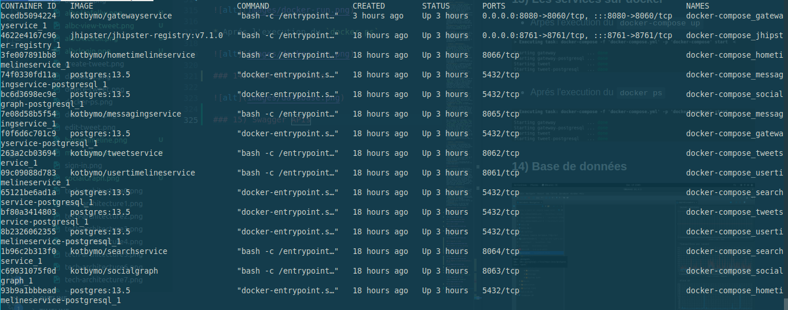

- [Modules, Fonctionnalités, et Inputs/Outputs](#modules-fonctionnalités-et-inputsoutputs)
  * [1) Tweet Service](#1-tweet-service)
  * [2) Search service](#2-search-service)
  * [3) User TimeLine Service](#3-user-timeline-service)
  * [4) Home TimeLine service](#4-home-timeline-service)
  * [5) Social Graph Service](#5-social-graph-service)
  * [6) Direct messages Service](#6-direct-messages-service)
- [Les interconnections](#les-interconnections)
- [Architecture Fonctionnelle](#architecture-fonctionnelle)
  * [1) Service direct messages](#1-service-direct-messages)
  * [2) Service du Tweet](#2-service-du-tweet)
  * [3) Service home timeline](#3-service-home-timeline)
  * [4) Service Social Graph](#4-service-social-graph)
  * [5) Service search](#5-service-search)
  * [6) Service User Time Line](#6-service-user-time-line)
- [Architecture Téchnique](#architecture-téchnique)
  * [1) Service direct messages](#1-service-direct-messages-1)
  * [2) Service social graph](#2-service-social-graph)
  * [3) Service home timeline](#3-service-home-timeline-1)
  * [4) Service user timeline](#4-service-user-timeline)
  * [5) Service search](#5-service-search-1)
  * [6) Service tweet](#6-service-tweet)
  * [7) Service twitter gateway](#7-service-twitter-gateway)
- [Cas d'interactions](#cas-dinteractions)
- [Drivers fonctionnels](#drivers-fonctionnels)
  * [1) Base de données](#1-base-de-données)
  * [2) Back-end](#2-back-end)
  * [3) Front-end](#3-front-end)
  * [4) Déployement et automation ](#4-déployement-et-automation)
  * [5) Orchestration](#5-orchestration)
- [Implémentation (Prof of Concept)](#implémentation-prof-of-concept)
  * [1) Twitter home page](#1-twitter-home-page)
  * [2) Sign in page](#2-sign-in-page)
  * [3) Uset TimeLine (mes tweet)](#3-uset-timeline-mes-tweet)
  * [4) Voir un tweet](#4-voir-un-tweet)
  * [5) Créer un tweet](#5-créer-un-tweet)
  * [6) Editer un tweet](#6-editer-un-tweet)
  * [7) Supprimer un tweet](#7-supprimer-un-tweet)
  * [8) Afficher la list des following](#8-afficher-la-list-des-following)
  * [9) Ajouter un follow a un user](#9-ajouter-un-follow-a-un-user)
  * [10) Ajouter un follow a un user](#10-ajouter-un-follow-a-un-user)
  * [11) Modefier le statut Follow/Unfollw a un user](#11-modefier-le-statut-followunfollw-a-un-user)
  * [12) Consulter la liste de tous les messages.](#12-consulter-la-liste-de-tous-les-messages)
  * [13) Les services sur docker](#13-les-services-sur-docker)
  * [14) Base de données](#14-base-de-données)
  * [15) Swagger APIs](#15-swagger-apis)
  * [16) Swagger example](#16-swagger-example)
  * [17) Tous les container docker de tous les composantes](#17-tous-les-container-docker-de-tous-les-composantes)
  <!-- TOC end -->

---

<!-- TOC -->

## Modules, Fonctionnalités, et Inputs/Outputs

<!-- TOC -->
### 1) Tweet Service
> le service qui gère tous les tweets publiés, ainsi que toutes les données associées. Il permet également la publication, la suppression et la modification des tweets.

| **Fonctionnalités** | **Inputs** | **Outputs** |
| ---- | ----- | ----- |
| Publication des tweets | Texte, images, personnes, dates, localisations... | post sur le *User Timeline* |
| Modification des tweets | Tweet, nouveau contenu | même post sur le *User Timeline* |
| Suppression des tweets | Tweet, validation de choix (car c'est irréversible) | supression de tweet |

<!-- TOC -->
### 2) Search service
> la fonctionnalité de recherche géré par la barre de recherche Twitter, elle permet de rechercher des personnes, des sujets et mots-clés.

| **Fonctionnalités** | **Inputs** | **Outputs** |
| ---- | ----- | ----- |
| Recherche des Personnes | mots-clés ou nom d'une personne | liste des sujet relatives aux mots-clés |
| Historique des recherche | User | liste des recherche faits précédemment |

<!-- TOC -->
### 3) User TimeLine Service
> pour afficher son propre TimeLine, qui ne contient que les Tweets publié par l’utilisateur et leurs retweets.

| **Fonctionnalités** | **Inputs** | **Outputs** |
| ---- | ----- | ----- |
| Affichage des postes | User/Page Id | Mure de la personne |
| Possibilité d’interagir | User/Page Id, post | réactions |
| Possibilité de commenter | User/Page Id, post | commentaires |
| Possibilité de Retweeter | User/Page Id, post | Le même post apparaît sur le mur de la personne |
| Possibilité de consulter les commentaires | User/Page Id, post | Lecture des commentaires |

<!-- TOC -->
### 4) Home TimeLine service
> pour afficher le Home TimeLine où toutes les publications des personnes que l’utilisateur suit apparaissent. Ça permet égalamenet d’afficher des rubriques de publicités.

| **Fonctionnalités** | **Inputs** | **Outputs** |
| ---- | ----- | ----- |
| Affichage des postes | User/Page Id | Mure de la personne |
| Possibilité d'interagir | User/Page Id, post | réactions |
| Possibilité de commenter | User/Page Id, post | commentaires |
| Possibilité de Retweeter | User/Page Id, post | Le même post apparaît sur le mur de la personne |
| Possibilité de consulter les commentaires | User/Page Id, post | Lecture des commentaires |
| Publicités | Préferences personnelles | Publicités personnalisées |

<!-- TOC -->
### 5) Social Graph Service
> pour gérer les relations entre les utilisateurs (Follow, Block…) 

| **Fonctionnalités** | **Inputs** | **Outputs** |
| ---- | ----- | ----- |
| S'abonner | User | Voir un contenu relative à la personne sur le home timeline, voir ses activités... |
| Bloquer | User | La personne ne peut ni suivre l'autre personne en question, ni lui envoie un message, ni voir son timeLine... |
| Se désabonner | User | La personne ne peut continuer à voir les postes de la personne en question mais moins fréquemment, et elle peux voir les siennes |
| Être suit | User | Le contenu relative à la personne va être promoté pour l'autre personne en question sur le home timeline, ainsi que ses activités... |

<!-- TOC -->
### 6) Direct messages Service
> Pour la gestion des conversation entre les utilisateurs

| **Fonctionnalités** | **Inputs** | **Outputs** |
| ---- | ----- | ----- |
| envoyer une demande d'envois de message | message (text,image,lien..) | accusé de réception de la demande |
| envoyer un message | message(text, image, lien) | accusé de réception du message |
| recevoir la notification d'un message | User | affichage du notification |
| recevoir un message | User | affichage d'un nouveau message |
| voir la historique des messages | User | list des messages |
| reagir a un message | User / message | reaction afficher sur le message |

<!-- TOC -->
## Les interconnections
> Plusieurs fonctionnalités peuvent voir des interconnections. Ceci se voit clairement par des dépendances, des partages de données, etc... Il est important de prendre en considérations toutes ces dernières. Puisque elles permettent de concevoir toute forme de partage et dépendances entre les fonctionnalités.

1. **Pour les fonctionnalités du Tweet Service**
   
    Les fonctionnalités de publication, de modification, et de suppression ont une partie commune entre eux car elles opèrent sur le même composant qui est un post. Notamment, la modification et la suppression d'un post dépend de la création de ce dernier.

2. **Pour les fonctionnalités du TimeLine Service**
   
    Les fonctionnalités du Timeline Service, qui sont dans l'affichage des postes, la réaction, la création des commentaire et le retweet opèrent toutes ensemble sur un post. En effet, les réactions et les commentaires n'ont aucun sens s'il ne sont pas liée a un post.
    
3. **Pour les fonctionnalités du Direct messages Service**

    Les fonctionnalités du Direct messages sévices qui se résument dans l'envoie et la réception des messages sont liées entre eux. En effet, un message envoyé est destiné à être lu.

---

<!-- TOC -->
## Architecture Fonctionnelle

La partie suivante décrit les différents services de l'application séparément, ainsi que les cas d'interactions possibles entre eux.

* En prenant en consédiration les fonctionnalités:

* En prenant en consédiration les choix techniques:

<!-- TOC -->
### 1) Service direct messages

<!-- TOC -->
### 2) Service du Tweet

<!-- TOC -->
### 3) Service home timeline

<!-- TOC -->
### 4) Service Social Graph

<!-- TOC -->
### 5) Service search

<!-- TOC -->
### 6) Service User Time Line

<!-- TOC -->
## Architecture Téchnique

La partie suivante décrit les différents services de l'application séparément, ainsi que les cas d'interactions possibles entre les entités englobées, et les téchnologies utilisées dans chaque service.

<!-- TOC -->
### 1) Service direct messages

<!-- TOC -->
### 2) Service social graph

<!-- TOC -->
### 3) Service home timeline

<!-- TOC -->
### 4) Service user timeline

<!-- TOC -->
### 5) Service search

<!-- TOC -->
### 6) Service tweet

<!-- TOC -->
### 7) Service twitter gateway

<!-- TOC -->
## Cas d'interactions

- **Description:**

| **Numéro de cas d'interaction** | **Description**                                              |
| ------------------------------- | ------------------------------------------------------------ |
| 1                               | L’utilisateur consulte son propre TimeLine, qui ne contient que les Tweets qu'il a  publié et leurs retweets. |
| 2                               | L’utilisateur publie, supprime et modifie ses propres tweets. |
| 3                               | L'utilisateur recherche des personnes, des sujets et des mots clés. |
| 4                               | L'utilisateur consulte toutes les publications des personnes qu'il suit. Ça permet également d’afficher des rubriques de publicités. |
| 5                               | L'utilisateur peut entamer, consulter, ou supprimer une conversation. |
| 6                               | Les fonctionnalités de publication, de modification, et de suppression des tweets pour un utilisateur affectent le userTimeLine. |
| 7                               | Si l'utilisateur cherche une information sur son TimeLine, le userTimeLine service serait appelé par le search service. |
| 8                               | Si l'utilisateur cherche une information, le homeTimeLine service serait appelé par le search service. |
| 9                               | Home timline service aura besoin de l'ensemble des twitte des personnes follower par le user. |

---

<!-- TOC -->
## Drivers fonctionnels

> Dans cette partie on va essayer de présenter en globalité l'ensemble des technologies utilisées dans ce projet. En outre, on va justifier ces choix > techniques. La justification importée pour ces choix serait comforme aux aspects suivants:
> - Performance de la téchnologie.
> - Compatbilité de la téchnologie de s'intérger avec d'autres technologies. 
> - Extensibilité pour des nouveaux changements.
> - Disponibilité des services.

<!-- TOC -->
### 1) Base de données
La base de données qu'on a choisi à utiliser dans ce projet est `PostgreSQL` avec `LiquidBase`. C'est une base de données relationnelle objet, tandis que les autres bases de données telles que MySQL sont purement relationnelles. Cela signifie que PostgreSQL offre des types de données plus complexes et permet aux objets d'hériter des propriétés, mais cela rend également le travail avec PostgreSQL plus complexe. Cela  se traduit par:

| **Aspect** | **Description** |
| --------------- | --------------- |
| **Performance** | Même que `PostgreSQL` est trés performantes et permets de gérer plusieurs types de données autres que les types traditionnelles de SQL, elle permet d'optimiser les requêtes en utilisants des outils (tel que ANALYZE) offers par la communité actives qui la supports. |
| **Compatbilité** | En utilisant Spring Data JPA et Hibernates ORM, on peut aisement connecter notre back-end à la base de données et effectuer toutes les opérations necessaires. |
| **Extensibilité** | `PostgreSQL` est facilement extensible puisque elle peut intégrer d'autres services. À l'instar des services de métrics et de discovery. Ceci généralement est réalisable en moyennant des APIs. |
| **Disponibilité** | `PostgreSQL` permet de bien assurer l'archivage des données. En utilisant aussi `LiquidBase` on peut bien assurer la disponibilité des donnée. |

<!-- TOC -->
### 2) Back-end
En ce qui concerne la partie back-end, on a opté à utiliser `Spring`. Ce dernier, est une technologie bien connu et ayant un grand support. Elle est bien connu par le nombre énnorme des modules qui englobe. Cetter richesse technique va permet de réaliser beaucoup de chose sans même s'ennyuer par la configuration. Ses avantages nombreux se manifestent par: 

| **Aspect** | **Description** |
| --------------- | --------------- |
| **Performance** | `Spring` offre deux modèles différents de travail selon le nombre des requêtes reçu: `Spring MVC` et `Spring WebFlux`. En ce sens, la performance de `Spring` est indiscutable. En outre, ces différents modules sont bien puissant et capable de satisfaire leurs besions. D'ailleurs, sont support à l'architecture microservice, le rend un choix techniques trés interessants.  |
| **Compatbilité** | `Spring` est compatible avec le choix de la bes de données pré-précisée. La spécification JPA qu'il intégre permet de bien gérer les données sous forme d'objet. |
| **Extensibilité** | L'adoptation du modèle REST dans `Spring` le rend trés extensible. Un point de plus qu'on peut utiliser aussi pour gérer nos APIs REST est OPEN API specification. Même l'uilisation du `GraphQL` ne pose plus un soucis. |
| **Disponibilité** | En utilisant un discovery service tel que Eureka, on peut toujours assurer l'état de nos services. |

<!-- TOC -->
### 3) Front-end

Pour bien présenter l'information à l'utilisatuer final, on choisi d'utiliser une technologies trés intéressante qui'esr `React`. Elle se base sur `JSX`, et supporte `TypeScript`. En plus, sa souplesse lors du développement, permet de suivre plusieurs organisation des composants de la partie front-end. Cette partie front-end sera contenu dans le service gateway. On peut clairement voire l'importance de ce choix en:

| **Aspect** | **Description** |
| --------------- | --------------- |
| **Performance** | `React` permet de réaliser le UI en travaillant sur plusieur composants séparemenet. Ceci, permet de reutiliser les composants. En addition, il utilise le virtual dom, donc on ne va plus surcharger en travaillant sur le dom. La diversité des librairies qui entrent dans l'écho-system de `React` offre plusieur choix pour faciliter le travail. |
| **Compatbilité** | `React` s'intégre facilement avec `Spring` en utilisant REST ou `GraphQL`. |
| **Extensibilité** | On peut toujours ajouter de nouvelles composants en réacts ou d'autres librairies. Aussi, on peut utiliser `Gatsby` static site generator pour générer des pages web statiques et optimiser le UI. |
| **Disponibilité** | La disponiblité de la partie front-end ne va pas poser un problèmes si on minimise l'utilisation des CDN externes. |

<!-- TOC -->
### 4) Déployement et automation 

Pour l'automation et le déployement, on a choisi d'utiliser `git` avec `husky`, `JUnit` et `Jest`, `docker` et `docker-compose`, et `Github Actions`. Le process qu'on va suivre est le suivant: on utilise `docker` et `docker-compose` pour contenir l'application et éxecuter les tests en `JUnit` et `Jest`. Par la suite, on utilise `git` pour le controle des versions et `husky` pour les executer les git-hooks. Ces derniers seront appelés par un `Github Actions` Workflow. Le résultats finals de ce workflow est un ensemble des logs permettants de vérifier que le realise de nouveau livrable était bien, et les images `docker` qui peuvent être déployées par le même workflow. On peut remarquer l'importance de ce process dans les points suivants:

| **Aspect** | **Description** |
| --------------- | --------------- |
| **Performance** | Ces téchnologies sont trés performantes et faciles (un tant soit peu) à implémenter. L'execution de ce process se fait dans le cloud. Il aura autant de ressource que le necessaire. |
| **Compatbilité** | Ces technologies s'intégrent bien sans aucun problèmes. Il suffit de bien gérer les versions des dépendances, et les ports des containers `docker` pour assurer que tout marcherait bien. |
| **Extensibilité** | La configuration de ce process se fait par des fichier `yaml` en générale. Ce qui permet de modifier le workflow facilement. |
| **Disponibilité** | Les métrics de ces process serait toujours disponibles pour les vérifier même aprés. |

<!-- TOC -->
### 5) Orchestration

Pour l'utilisation local on peut utiliser `docker swarm mode` pour l'orchestration des noeux et les réseaux des images. Ce mode intégré en `docker` permet d'avoir un modèle minmaliste de la production. Ce modèle contient toutes les images necessaires pour que l'application tourne. Chaque service est dans sa propre container. Le tout est dans le même réseaux. On peut avoir plusieur réplicas du même réseaux. Certes, ceci permet de tester l'application de un petit context de test. Mais, il faut penser vraiment à d'autre alternatives pour une production à grande échelle tel que `kubernetes`. Néanmoins, ce choix téchnique se justifie par:

| **Aspect** | **Description** |
| --------------- | --------------- |
| **Performance** | Il permet de voir l'état des réplicas et de controller leurs nombers et de redresser les noeux tombants. Tous se gère automatiquement, en se basant sur un fichier décrivant le stack trés proches au fichier utiliser pour `docker-compose`. |
| **Compatbilité** | Il trés compatible avec `docker-compose` puisque leurs configurations ne se différnent pas beaucoup. |
| **Extensibilité** | Ce choix téchnique permet de bien penser les autres choix en cas de production. |
| **Disponibilité** | Ce service serait toujours disponibles et offre des logs décrivants l'état de l'application.* |

<!-- TOC -->
## Implémentation (Prof of Concept)

<!-- TOC -->
### 1) Twitter home page

<!-- TOC -->
### 2) Sign in page

<!-- TOC -->
### 3) Uset TimeLine (mes tweet)

<!-- TOC -->
### 4) Voir un tweet

<!-- TOC -->
### 5) Créer un tweet

<!-- TOC -->
### 6) Editer un tweet

* Edition du tweet

<!-- TOC -->
### 7) Supprimer un tweet

<!-- TOC -->
### 8) Afficher la list des following

<!-- TOC -->
### 9) Ajouter un follow a un user

<!-- TOC -->
### 10) Ajouter un follow a un user

<!-- TOC -->
### 11) Modefier le statut Follow/Unfollw a un user

<!-- TOC -->
### 12) Consulter la liste de tous les messages.

<!-- TOC -->
### 13) Les services sur docker

* Arpés l'execution du `docker-compose up`

* Aprés l'execution du `docker ps`

<!-- TOC -->
### 14) Base de données

<!-- TOC -->
### 15) Swagger APIs

<!-- TOC -->
### 16) Swagger example

<!-- TOC -->
### 17) Tous les container docker de tous les composantes

